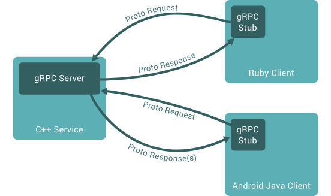

# gRPC

- [1. 基本概念](#1-基本概念)
- [2. 优缺点](#2-优缺点)
- [3. 主要使用场景](#3-主要使用场景)
- [4. 结构总揽](#4-结构总揽)
- [5. Protocol Buffers 的简单使用](#5-protocol-buffers-的简单使用)
  - [5.1. 定义需要序列化的数据结构](#51-定义需要序列化的数据结构)
  - [5.2. 使用 Protocol Buffers 的编译器 protoc 进行编译](#52-使用-protocol-buffers-的编译器-protoc-进行编译)
  - [5.3. 定义 gRPC 服务](#53-定义-grpc-服务)
- [6. gRPC 核心技术原理](#6-grpc-核心技术原理)
  - [6.1. 服务接口定义](#61-服务接口定义)
  - [6.2. API的使用](#62-api的使用)
  - [6.3. gRPC 的生命周期](#63-grpc-的生命周期)
  - [6.4. gRPC 的结束](#64-grpc-的结束)
  - [6.5. 其他概念](#65-其他概念)
- [7. 实践例子（C++）](#7-实践例子c)
- [8. 更多参考](#8-更多参考)
- [9. 参考文献](#9-参考文献)

本文简单介绍gRPC的概念和基本的使用方法。

## 1. 基本概念

gRPC是2015年Google开发的一个开源RPC系统框架。它使用**HTTP/2协议**进行数据传输，Protocol Buffers作为接口描述语言（IDL）和基础消息交换格式，提供的功能包括：身份验证、负载均衡、双向流和流控制、阻塞或非阻塞绑定以及取消和超时等等。

gRPC是可以在任何环境中运行的现代开源高性能RPC框架。它可以为**多种语言**生成跨平台的客户端和服务器绑定。它可以通过可插拔的支持来有效地连接数据中心内部或跨数据中心的服务，以实现负载平衡、跟踪、运行状况检查和身份验证。它也适用于分布式计算的最后一英里，以将设备、移动应用程序和浏览器连接到后端服务。

gRPC官方对REST的声音是：和REST一样遵循HTTP协议(明确的说是HTTP/2)，但是gRPC提供了全双工流和传统的REST不同的是gRPC使用了静态路径，从而提高性能，用一些格式化的错误码代替了HTTP的状态码更好的标示错误。

## 2. 优缺点

优点：

1. 简单的服务（API）定义
2. 具有高效紧凑的进程通信机制，在交换大量消息时效率高（低延迟）。（Protocol Buffers带来的优点）
3. 跨语言和平台工作，自动以多种语言和平台生成客户端和服务器stub
4. 双向流和集成身份验证。使用双向流传输和完全集成的可插入身份验证以及基于HTTP/2的传输
5. 快速启动和自动扩展（高扩展性）。只需一行代码即可安装运行时和开发环境，并通过该框架每秒可扩展至数百万个RPC

缺点：

1. 不方便与JavaScript集成，某些防火墙不支持该协议。
2. 不直接提供服务发现和负载均衡等功能，但可能会预留相应的接口。

## 3. 主要使用场景

1. 低延时、高可用的分布式系统；
2. 移动端与云服务端的通讯；
3. 使用protobuf，独立于语言的协议，支持多语言之间的通讯；
4. 可以分层扩展，如：身份验证，负载均衡，日志记录，监控等。

在微服务场景中使用究竟是否要使用grpc呢？开源社区较为成熟的微服务框架有dubbo、spring cloud。dubbo虽然在服务治理上做的比较完善，但是不支持跨语言。个人觉得，如果不考虑跨语言问题，选用dubbo。考虑跨语言，可以选用grpc、Thrift，但是grpc、Thrift没有服务发现和负载均衡机制，一般使用代理转发负载均衡控制策略。

在移动端app应用场景中，grpc以其优异的性能，因pb和http2的特性，为移动端用户节省流量、电量。对比传统的http1.1+json方式，建议可以先尝试小范围使用grpc，待系统稳定后，再扩大grpc使用范围

总的来看，gRPC是一个通用的的RPC框架，但更偏向于移动应用，总体比较强大。

## 4. 结构总揽

与常规的RPC一样，gRPC也是通过生成客户端Stub来进行远程调用的代理。



从Google内部的服务器到自己的台式机，gRPC客户端和服务器可以在各种环境中运行并相互通信，并且可以在多种支持的语言中使用gRPC。例如，可以使用Go，Python或Ruby的客户端轻松地调用由Java创建的gRPC服务。此外，最新的Google API的接口将具有gRPC版本，可让用户轻松地在应用程序中内置Google功能。

## 5. Protocol Buffers 的简单使用

默认情况下，gRPC使用 Protocol Buffers 来编解码数据。Protocol Buffers也可以与其他协议一起使用，比如JSON。这里简单介绍Protocol Buffers是怎么工作的。

### 5.1. 定义需要序列化的数据结构

数据结构的定义在后缀名为 `.proto`的文本文件中进行。Protocol Buffers将结构化的数据构造为消息（message），一条消息包含多个称为字段（fields，即成员变量）的name/value对，类似于键值对，分别对应于数据结构中的成员名以及该成员的具体值。下面是一个简单的例子。

```cpp
message Person {
  string name = 1;
  int32 id = 2;
  bool has_ponycopter = 3;
}
```

每一条消息都以 `message` 开头，然后是消息体名 `Person` ，与结构体类似，消息体中可以定义多个成员字段，每个字段包含类型以及字段名。每一个字段都有唯一的编号，用于在消息的二进制格式中唯一标识该字段，而且一旦使用了，编号就不能再修改，否则可能会出现错误，注意的是，编号1-15只需要一个byte进行编码，而其他编号需要更多。因此，对于经常使用的字段，尽量使用1-15进行编号。

### 5.2. 使用 Protocol Buffers 的编译器 protoc 进行编译

protoc编译器可以根据前面proto文件中的定义生成指定语言的数据访问结构，如C++语言中的类。类中的每个成员变量都会有对应的读写方法，比如对于前面定义的Person中的name字段，会生成name()和set_name()方法。另外，还提供将整个数据结构序列化为字节串、以及从字节串中解析成数据结构的方法。

### 5.3. 定义 gRPC 服务

可以在`.proto`文件中定义gRPC服务，并将RPC方法（函数）的参数和返回值类型指定为 Protocol Buffers 定义的消息（message）。

```cpp
// The greeter service definition.
service Greeter {
  // Sends a greeting
  rpc SayHello (HelloRequest) returns (HelloReply) {}
}

// The request message containing the user's name.
message HelloRequest {
  string name = 1;
}

// The response message containing the greetings
message HelloReply {
  string message = 1;
}
```

根据指定的`.proto`文件，gRPC使用编译器protoc和特殊的gRPC插件一起来生成代码（包括客户端和服务器）。

## 6. gRPC 核心技术原理

### 6.1. 服务接口定义

默认情况下，gRPC使用protocol buffers作为接口定义语言（IDL），用于描述服务接口和有效负载消息的结构。如果需要，也可以使用IDL代替。

在gRPC中可以定义4种服务方法：

1. 一元（简单）RPC。客户端向服务器发送单个请求并获得单个响应，就像普通函数调用一样。

   ```cpp
   rpc SayHello(HelloRequest) returns (HelloResponse);
   ```

2. 服务器流式RPC。客户端向服务器发送请求后，将获得流形式的一系列消息回复。客户端从返回的流中读取，直到没有更多消息为止。gRPC保证单个RPC调用中的消息顺序。

   ```cpp
   rpc LotsOfReplies(HelloRequest) returns (stream HelloResponse);
   ```

3. 客户端流式RPC。客户端远程调用时，将参数以流的形式发送一系列消息给服务器。客户端写完消息后，它将等待服务器读取消息并返回响应。gRPC同样保证了在单个RPC调用中的消息顺序。

   ```cpp
   rpc LotsOfGreetings(stream HelloRequest) returns (HelloResponse);
   ```

4. 双向流式RPC。双方都使用读写流发送一系列消息。这两个流是独立运行的，因此客户端和服务器可以按照自己喜欢的顺序进行读写：例如，服务器可以在写响应之前等待接收所有客户端消息，或者可以先读取一条消息再写入一条消息，又或者其他一些读写组合。每个流中的消息顺序都会保留。

   ```cpp
   rpc BidiHello(stream HelloRequest) returns (stream HelloResponse);
   ```

流式的gRPC将意味着可能发送多个参数消息、多次函数执行和收到多个回复消息？

### 6.2. API的使用

生成的客户端和服务器具有相同的接口定义，用户需要在客户端调用这些API，然后在服务器端实现相应的API。

- 在服务器端，服务器实现服务声明的方法，并运行gRPC服务器来处理客户端调用。gRPC框架解码传入的请求，执行服务方法，并对服务响应进行编码返回。
- 在客户端，客户端具有称为stub的本地对象（或称为client），该对象实现与服务相同的方法。然后，客户端可以只在本地对象stub上调用这些方法，stub将调用的参数包装在适当的协议缓冲区消息类型中，然后将请求发送到服务器。

### 6.3. gRPC 的生命周期

本小节主要介绍gRPC从发起到结束经历的情况。当然具体到不同的语言会有细微的区别。

- 一元RPC
    首先考虑最简单的RPC类型：一元RPC，其中客户端发送单个请求并收到单个响应。具体过程和常规的RPC类似。

    1. 客户端调用stub方法后，会发消息通知服务器，信息包括该调用的元数据、方法名和指定的截止日期（如果适用）。
    2. 然后，服务器可以先立即发送自身的初始元数据（如果发送，则必须在发送任何响应之前），也可以等待客户端的请求消息（此时才发送调用的参数）。哪一个先发生是由应用程序确定的。
    3. 服务器收到客户端的请求消息后，它将执行调用，然后将响应（如果成功）连同状态的详细信息（状态代码和可选状态消息）以及可选尾随元数据一起返回。
    4. 如果响应状态为OK，则客户端将获得响应，从而完成客户端的调用。

- 服务器流式RPC
    类似于一元RPC，但是服务器是按照流式来返回客户端请求的响应消息。发送所有调用返回的消息后，服务器的详细状态信息（状态代码和可选状态消息）和可选尾随元数据将发送到客户端，这样就完成了服务器端的处理。当客户接收到所有服务器的消息后，RPC才算完成。

- 客户端流式RPC 
    客户端流式RPC与一元RPC相似，不同之处在于客户端将消息以流的形式发送到服务器而不是单个消息。服务器以一条消息（以及其状态详细信息和可选的尾随元数据）进行响应。**注意，服务器通常是在收到所有客户端消息之后才进行响应（但不是必须的）**。

- 双向流式RPC。
    在双向流式RPC中，客户端启动调用后，服务器将接收客户端元数据，方法名和期限等信息。然后，服务器可以选择发回其初始元数据，也可以等待客户端开始流式传输消息（参数等）。

    客户端和服务器端的流如何处理是由应用程序规定的。注意的是，两个流是相互独立的，因此客户端和服务器可以按任何顺序读取和写入消息。例如，服务器可以等到收到客户端的所有消息后再写响应消息，或者服务器和客户端可以打“乒乓”——服务器每收到一个请求，就发回一个响应；同样，客户端收到上一个请求的响应后，才发送下一个请求。

### 6.4. gRPC 的结束

除了上述正常的结束情况外，RPC还有可能是由于其他情况而发生来终止。

1. 截止时间/超时

    gRPC允许客户端指定一个RPC的超时时间。服务器可以查询某个RPC是否超时，或者距离超时还剩多少时间。

    如何指定超时是和语言相关的，一些语言可以指定RPC的最长执行时间，一些语言可以指定RPC执行的截止时间。RPC可能有也可能没有默认的超时时间，和具体的语言相关。

2. RPC终止（termination）

    在gRPC中，客户端和服务器对调用的成功进行**独立和本地确定**，它们的结论可能不匹配。也就是说，可能在服务器端已经认为RPC成功完成了（即已经发送所有的响应！），但是在客户端却失败了（比如，响应在客户端的截止时间之后才到达！）。另外，服务器还可能在客户端发送所有请求之前就确认RPC完成了。

3. RCP取消

    客户端或服务器都可以随时取消RPC。取消操作会立即终止RPC，不再进行任何工作。

    **注意的是，取消RPC后，之前所做的更改不会回滚。**

### 6.5. 其他概念

1. 元数据（Metadata ）

    元数据是以键-值对的列表形式提供的有关RPC调用的信息（例如身份验证详细信息），其中键是字符串，值通常也是字符串，但也可以是二进制数据。元数据对于gRPC本身是不透明的-它允许客户端向服务器提供与调用相关的信息，反之亦然。

    对元数据的访问取决于具体的语言。

2. 通道（Channels）

    gRPC通道提供从服务器到指定主机和端口上的gRPC服务器的连接。创建客户端stub时使用到它。客户端可以指定通道参数来修改gRPC的默认行为，例如打开或关闭消息压缩。通道具有状态，包括connected和idle。

    gRPC如何处理关闭通道取决于具体语言。某些语言还允许查询通道的状态。

## 7. 实践例子（C++）

参考官网文档：[Quick start](https://grpc.io/docs/languages/cpp/quickstart/)

编译安装的问题注意：<https://github.com/zzh-wisdom/rpc/tree/master/docs/my-build.md>

## 8. 更多参考

- gRPC github: <https://github.com/grpc/grpc>
- protobuf github: <https://github.com/protocolbuffers/protobuf>
- Protocol Buffers安装参考文档：<https://github.com/protocolbuffers/protobuf/blob/master/src/README.md>

## 9. 参考文献

1. 维基百科gRPC：<https://en.wikipedia.org/wiki/GRPC>
2. gRPC Home Page：<https://grpc.io/>
3. gRPC简介：<https://grpc.io/docs/what-is-grpc/introduction/>
4. gRPC服务发现&负载均衡：<https://segmentfault.com/a/1190000008672912>
5. Grpc应用场景分析: <https://ask.zkbhj.com/?/article/223>
