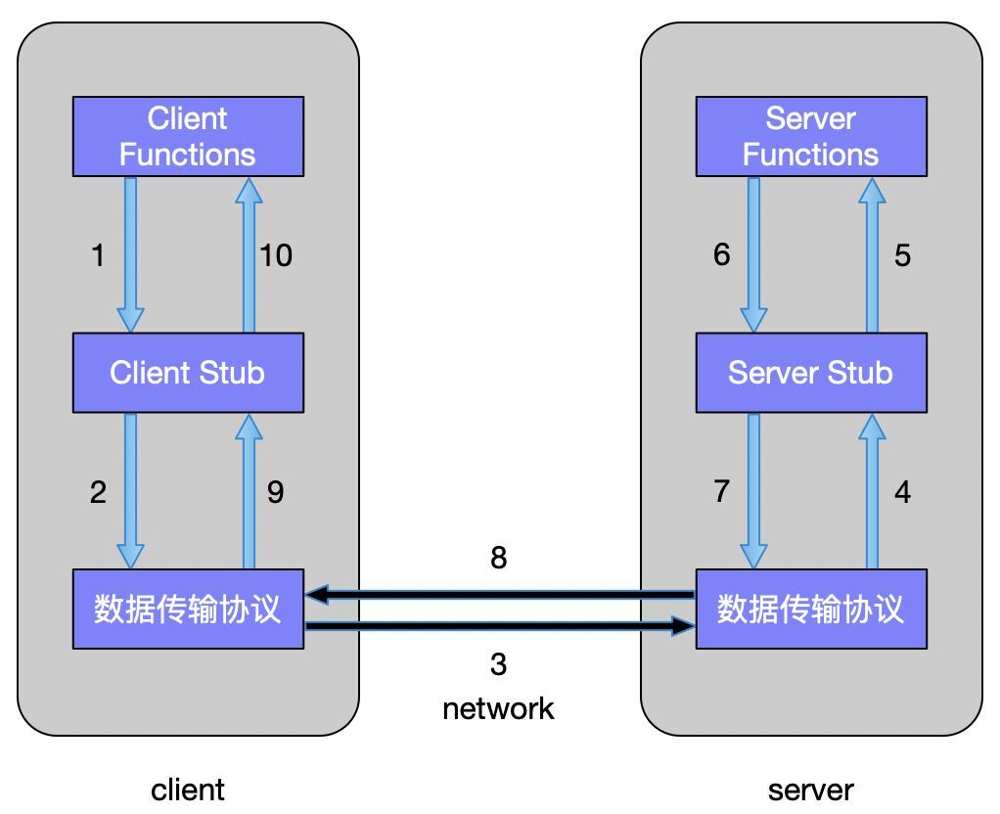

# RPC 基础篇

- [1. 基本概念](#1-基本概念)
  - [1.1. 特性](#11-特性)
- [2. 出现背景](#2-出现背景)
  - [2.1. 为什么需要 RPC](#21-为什么需要-rpc)
  - [2.2. RPC 起源](#22-rpc-起源)
  - [2.3. RPC 设计目标](#23-rpc-设计目标)
- [3. RPC 结构](#3-rpc-结构)
- [4. RPC的消息传递](#4-rpc的消息传递)
  - [4.1. 消息传递的步骤](#41-消息传递的步骤)
  - [4.2. 数据传输协议](#42-数据传输协议)
- [5. 一个简单实现例子](#5-一个简单实现例子)
- [6. RPC 类型](#6-rpc-类型)
- [7. 优点](#7-优点)
- [8. 缺点](#8-缺点)
- [9. 参考文献](#9-参考文献)

基础篇主要介绍RPC的基础知识，包括基本概念、出现背景、简单的原理（结构、消息传递机制等等）、RPC的类型以及优缺点。

## 1. 基本概念

RPC(Remote Procedure Call，远程过程调用)是指计算机程序使过程（子例程）在不同的地址空间（通常在共享网络的另一台计算机上）执行时，其编码方式就像是正常的（本地）过程调用，而无需程序员明确为远程交互编码细节。*通俗来说，RPC用于调用远程系统上的其他过程,表面却如同调用本地系统的过程一样。*

**过程调用**有时也称为**函数调用**或**子例程调用**。

**地址空间**：不同的进程具有不同的地址空间：

1. 同一主机上，即使物理地址空间相同，它们也具有不同的虚拟地址空间；
2. 如果进程位于不同的主机上，则物理地址空间是不同的。

RPC是进程间通信（IPC）的一种形式。

### 1.1. 特性

1. 使用**客户端-服务器**模型交互（调用者是客户端，执行者是服务器）
2. 一般地，通过**请求-响应的消息传递方式**来实现。
3. 一定程度的**位置透明性**，无论是本地调用还是远程调用，调用过程在很大程度上是相同的。
4. 对于本地程序和远程程序，程序员都编写基本相同的代码。在面向对象的编程范例中，RPC由远程方法调用表示（RMI）
5. 远程调用通常比本地调用慢几个数量级，并且可靠性较差。所以实际使用需要严格区分他们。

## 2. 出现背景

### 2.1. 为什么需要 RPC

这是应用开发到一定的阶段的强烈需求驱动的。

1. 对于访问量不大的单一应用，简单使用单机系统即可；
2. 当系统访问量增大、业务增多时，单机的系统已经无法承受。可以将业务拆分成几个**互不关联的应用**，分别部署在各自机器上，以划清逻辑并减小压力。此时也不涉及交互。
3. 当业务越来越多、越来越复杂时，有些功能已经不能简单划分开来。此时，可以将**公共业务逻辑**抽离出来，将之组成独立的服务Service应用 。而原有的、新增的应用都可以与那些独立的Service应用交互，从而完成完整的业务功能。这种情况，我们急需一种高效且简单的应用程序之间的通讯手段来完成这种需求。RPC很好地解决了这些难题。

RPC将通信过程中涉及的很多问题进行了封装，使得应用开发更加简单和高效，广泛应用于微服务架构中。

### 2.2. RPC 起源

RPC 这个概念术语在上世纪 80 年代由 Bruce Jay Nelson 提出，当初开发 RPC 的动机主要有以下几点：

1. 简洁明了的语义。分布式计算的构建和正确性变得更加容易
2. 效率。调用过程足够简单，使得通信速度相当快
3. 通用性。在单机计算中过程（函数）往往是算法不同部分间最重要的通信机制，这样RPC符合大部分应用场景。

简单来说，RPC 的主要功能目标是让构建分布式计算（应用）更容易，在提供强大的远程调用能力时不损失本地调用的语义简洁性。

### 2.3. RPC 设计目标

Nelson 的论文中提到了几点RPC框架需要达到的目标：

1. 简化分布式计算。开发人员不用关注任何通信细节，只用考虑分布式系统的核心问题：计时、各独立组件的故障和独立运行逻辑的划分。
2. RPC通信更加高效。
3. RPC提供的语义尽量强大。
4. RPC的安全通信。

今天我们使用的 RPC 框架基本就是按这些目标来实现的。

## 3. RPC 结构

Nelson 的论文中指出实现 RPC 的程序包括 5 个部分：

1. User
2. User-stub
3. RPCRuntime
4. Server-stub
5. Server

这 5 个部分的关系如下图所示。

这里 user 就是 client 端，当 user 想发起一个远程调用时，它实际是通过本地调用 user-stub。user-stub 负责将调用的接口、方法和参数通过约定的协议规范进行编码并通过本地的 RPCRuntime 实例传输到远端的实例。远端 RPCRuntime 实例收到请求后交给 server-stub 进行解码后发起本地端调用，调用结果再返回给 user 端。

## 4. RPC的消息传递

RPC使用**请求-响应协议**(request–response protocol)进行通信。

==远程服务器会不断监听客户端发来的请求。客户端启动一个RPC时，会将请求消息发送到已知的远程服务器，远程服务器收到请求后，使用提供的参数执行指定的过程，执行完成后，将响应（结果）发送回客户端，然后客户端的应用程序继续执行后续的过程。==

- `stub`：一段代码，用于转换在远程过程调用（RPC）期间在客户端和服务器之间传递的参数，如编码、解码。
- `数据传输协议`：完成客户端和服务器之间的消息传输。可以根据需要使用具体的协议，如TCP等。

客户端和服务器中都存在一个stub。客户端stub第一次被调用时，它与`名称服务器(name server)`联系，以确定服务器所在的传输地址（IP与端口号）。

启动后，**客户端的运行时程序Runtime**已经了解了如何寻址远程计算机和服务器应用程序，以及如何通过网络发送请求远程进程的消息。同样，服务器包括一个运行时程序以及一个与远程过程本身进行接口交互的stub。

### 4.1. 消息传递的步骤

1. 客户端调用客户端的stub。该调用是本地过程调用，其中参数以正常方式压入堆栈。
2. 该客户端stub将参数打包为一个消息，然后通过系统调用来发送消息。打包参数的过程称为编组（marshalling）。
3. 客户端的本地操作系统将消息从客户端机器发送到服务器机器。
4. 服务器机器上的本地操作系统将传入的数据包传递到服务器stub。
5. 服务器stub从消息中解压参数。解压参数的过程称为解组（unmarshalling）。
6. 最后，服务器stub调用指定的过程。执行结果的回复沿上述步骤的逆过程进行。

### 4.2. 数据传输协议

RPC中常用来传输数据的协议有：

- TCP，数据传输在传输层完成，效率较高。
- HTTP，数据传输在应用层完成，整个通信的代价较高。

## 5. 一个简单实现例子

RPC没有统一的实现标准，这里举一个简单的实现例子以帮助理解。

假设一个函数Func(params)需要在远程服务器运行，为了方便函数的查找，可以维护一个从函数到ID的映射（称为callIdMap），同样远程服务器也要维护一个相同的映射。远程调用时，客户端将Call ID和Params编码成消息，通过TCP传输给服务器。服务器解码后得到Call ID，并通过callIdMap得到对应的函数指针，然后再使用传入的参数Params调用该函数。执行完成后将结果返回给客户端。

执行过程可以总结如下：

- 客户端
    1. 客户端远程调用函数Call(ServerAddr, Func, Params)
    2. 将这个调用映射为Call ID
    3. 将Call ID，Params序列化（marshalling），以二进制形式打包
    4. 将数据包发送给ServerAddr，该过程由TCP完成
    5. 等待服务器返回结果
    6. 如果服务器调用成功，那么将返回的结果反序列化
    7. 返回到调用处
- 服务器
    1. 等待客户端请求
    2. 得到一个请求后，将其数据包反序列化，得到Call ID
    3. 通过在callIdMap中查找，得到相应的函数指针（func name）
    4. 使用反序列化得到的Params，本地调用函数Func(Params)，得到结果
    5. 将结果result序列化后通过TCP返回给Client
- 注册
为了保证客户端和服务器中callIdMap数据的一致性，客户端新增一个远程调用时，需要先在服务器端进行注册，以告知服务器如何执行该调用，并更新自己的callIdMap。通常，该过程是在编译的时候完成的。（因为通常在编译阶段就已经决定哪些函数需要在远端执行）

## 6. RPC 类型

根据使用的方式，RPC可以分为五种类型：

1. 同步。一种普通的操作方法，客户端调用远程过程，阻塞到服务器返回回复后才继续执行。
2. 异步。客户端进行调用并继续其自己的处理，不等待服务器回复。
3. 异步批操作。批量发送多个客户端的非阻塞调用。
4. 广播。RPC客户端具有广播功能，即，它们可以将消息发送到许多服务器，然后接收所有结果答复。
5. 异步通知模式。客户端进行无阻塞的客户端/服务器调用；服务器通过调用与客户端关联的过程来指示呼叫已完成。

常用的是前面两种。

**说明**：使用共享相同地址空间的**轻量级进程**或**线程**可以同时执行多个（同步）RPC。

## 7. 优点

1. 可以直接使用传统高级语言的过程调用来实现客户端与服务器之间的通信；
2. 可以在分布式环境以及本地环境中使用；
3. 支持面向进程和面向线程的模型；
4. 向用户**隐藏**内部消息传递机制（如安全性、正确性等等）；
   - 不必考虑传输的端口号，服务器可以绑定到任何可用的端口号，然后将该端口注册到RPC名称服务器。客户端将访问该名称服务器以查找所需服务程序相对应的端口号。所有这些对于程序员都是不可见的。
   - RPC与具体的传输协议是独立，用户可以选择不同的传输协议协议，而无须修改任何代码。
   - 客户端只需要知道名称服务器的传输地址。
5. 只需很少的精力即可**重写和重新开发代码**；
6. **提供抽象**，隐藏网络通信细节
7. 省略了许多协议层（OSI中的会话层和表示层）以**提高性能**。

## 8. 缺点

1. 客户端和服务器为各自的例程使用不同的执行环境，并且资源（例如文件）的使用也更加复杂。因此，**RPC系统并不真正适合传输大量数据**。
2. RPC非常**容易出错**，因为它涉及通信系统，另一台计算机和另一个进程。
3. RPC**没有统一的标准**。它可以通过多种方式实现。
4. RPC仅基于交互，因此，就硬件体系结构而言，它**不提供任何灵活性**。

**说明**：RCP只规定具体的功能，而对底层实现没有统一的标准。因此，由于不同的实现对消息传递、同步等方面的处理方式不一样，现有的很多RPC协议互不兼容。

## 9. 参考文献

1. 维基百科 Remote procedure call：<https://en.wikipedia.org/wiki/Remote_procedure_call>
2. Remote Procedure Call (RPC)：<https://searchapparchitecture.techtarget.com/definition/Remote-Procedure-Call-RPC>
3. 什么是RPC？：<https://www.jianshu.com/p/7d6853140e13>
4. 深入浅出 RPC - 浅出篇：<https://blog.csdn.net/mindfloating/article/details/39473807>
5. Birrell, Andrew D., and Bruce Jay Nelson. "Implementing remote procedure calls." ACM Transactions on Computer Systems (TOCS) 2.1 (1984): 39-59.
6. RPC入门总结（一）RPC定义和原理： <https://blog.csdn.net/kingcat666/article/details/78577079>
