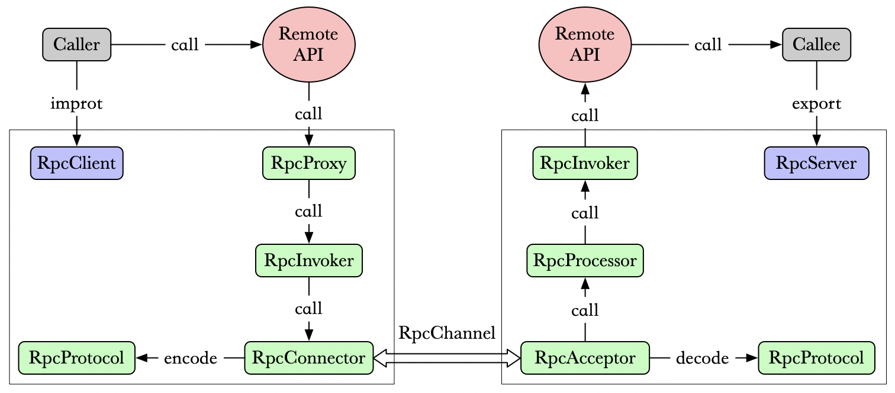

# RPC 深入篇

- [1. RPC 的结构拆解](#1-rpc-的结构拆解)
- [2. RPC 核心技术](#2-rpc-核心技术)
  - [2.1. 服务暴露](#21-服务暴露)
  - [2.2. 远程代理](#22-远程代理)
  - [2.3. 协议编解码](#23-协议编解码)
  - [2.4. 通信](#24-通信)
  - [2.5. 调用执行](#25-调用执行)
  - [2.6. RPC 异常处理与性能开销](#26-rpc-异常处理与性能开销)
- [3. RPC 其他实现问题](#3-rpc-其他实现问题)
  - [3.1. 如何传递参数？](#31-如何传递参数)
  - [3.2. 如何表示数据？](#32-如何表示数据)
  - [3.3. 如何绑定到机器端口？](#33-如何绑定到机器端口)
  - [3.4. 远程调用的语义是什么？](#34-远程调用的语义是什么)
  - [3.5. 安全性问题？](#35-安全性问题)
- [4. 总结](#4-总结)
- [5. 参考文献](#5-参考文献)

主要介绍RPC框架的实现原理、核心技术和其他一些需要注意的问题等等。

## 1. RPC 的结构拆解

基础篇给出了RPC的基本结构，这里进一步拆解。



RPC 服务方通过 RpcServer 去导出（export）远程接口方法，而客户方通过 RpcClient 去引入（import）远程接口方法。客户方像调用本地方法一样去调用远程接口方法，RPC 框架提供接口的代理实现，实际的调用将委托给代理RpcProxy 。代理封装调用信息并将调用转交给RpcInvoker 去实际执行。在客户端的RpcInvoker 通过连接器RpcConnector 去维持与服务端的通道RpcChannel，并使用RpcProtocol 执行协议编码（encode）并将编码后的请求消息通过通道发送给服务方。

RPC 服务端接收器 RpcAcceptor 接收客户端的调用请求，同样使用RpcProtocol 执行协议解码（decode）。解码后的调用信息传递给RpcProcessor 去控制处理调用过程，最后再委托调用给RpcInvoker 去实际执行并返回调用结果。

各个部分的详细功能说明如下：

1. RpcServer
   负责导出（export）远程接口，
2. RpcClient
   负责导入（import）远程接口的代理实现
3. RpcProxy
   远程接口的代理实现
4. RpcInvoker
   客户方实现：负责编码调用信息和发送调用请求到服务方并等待调用结果返回
   服务方实现：负责调用服务端接口的具体实现并返回调用结果
5. RpcProtocol
   负责协议编/解码
6. RpcConnector
   负责维持客户方和服务方的连接通道和发送数据到服务方
7. RpcAcceptor
   负责接收客户方请求并返回请求结果
8. RpcProcessor
   负责在服务方控制调用过程，包括管理调用线程池、超时时间等
9. RpcChannel
   数据传输通道

其中，RpcServer与RpcClient通信协商以确认哪些调用在远程执行。

## 2. RPC 核心技术

简单介绍RPC框架实现的几个核心技术点。

### 2.1. 服务暴露

这部分对应于结构图中的RpcServer和RpcClient。

远程提供者需要以某种形式提供**服务调用相关的信息**，包括但不限于**服务接口定义**、**数据结构**、或者**中间态的服务定义文件**。服务的调用者需要通过一定的途径获取远程服务调用相关的信息。主要有两种方式：

- **静态方式**：大部分跨语言平台的 RPC 框架使用 IDL 定义接口，并通过 code generator 生成 stub 代码，这种方式下实际导入的过程就是通过**代码生成器在编译期**完成的，如 CORBAR、WebService、ICE、Thrift。代码生成的方式对跨语言平台 RPC 框架而言是必然的选择。
- **动态方式**：对于**同一语言平台**的 RPC 则可以通过**共享接口定义**来实现，这种方式在一些框架中本质也是一种代码生成技术，只不过是在运行时生成，比静态编译期的代码生成看起来更加简洁和灵活。

java 中还有一种比较特殊的调用就是**多态**，也就是一个接口可能有多个实现，那么远程调用时到底调用哪个？这个本地调用的语义是通过 jvm 提供的引用多态性隐式实现的，那么对于 RPC 来说**跨进程的调用**就没法隐式实现了（因为跨进程调用并不知道一个接口引用具体指向哪一个实例）。如果一个接口有 2 个实现，那么在导出接口时就需要特殊**标记**不同的实现，那么远程调用时也需要传递该**标记**才能调用到正确的实现类，这样就解决了多态调用的语义问题。

```java
DemoService demo   = new ...;
DemoService demo2  = new ...;
RpcServer   server = new ...;
server.export(DemoService.class, demo, options);
server.export("demo2", DemoService.class, demo2, options);
```

在我的理解是，对于非多态调用，直接使用类名进行唯一标记，服务端通过**反射**来找到具体的函数过程；对于多态调用的话，需要额外定义**标记**，以区分不同的实现。

### 2.2. 远程代理

对应于RpcProxy

RPC表面看来就是调用远程服务的本地代理。类似于服务暴露，代理也有静态和动态两种，动态代理具有更好的灵活性和可维护性，但性能会有所下降。

### 2.3. 协议编解码

客户端代理在发起调用前需要对调用信息进行编码。编码方式是影响RPC效率的重要因素之一。一般来说，编码的信息越少越好（传输数据少），编码的规则越简单越好（执行效率高）。首先看一下需要编码的信息。

1. 必要信息
   为了完成RPC的基本功能，下列信息是必须的。
   - 调用编码
     1. 方法名
        包括类/接口名、方法名
     2. 方法参数
        包括参数类型、参数值
     3. 调用属性
        包括调用属性信息，例如调用附件隐式参数、调用超时时间等
   - 返回编码
     1. 返回结果
        接口方法中定义的返回类型、返回值等
     2. 返回码
        状态返回码，指示是否存在异常
     3. 返回异常信息
        描述调用异常的具体情况
2. 元信息
   除了以上这些必须的调用信息，我们可能还需要一些**元信息**以方便程序编解码以及未来可能的扩展。

根据上述的信息情况，可以设计一种简单消息编码格式。**元信息**放在消息的头部，而**必要信息**放在消息体（body）中

```txt
000-------------------------------015-------------------------------031
|               magic              |            header size           |
032---------039----044--045--046--047--------------055--------------063
|   version  |  st  | hb | ow | rp |   status code  |    reserved     |
064-----------------------------------------------------------------095
|                              message id                             |
|                                                                     |
096-----------------------------------------------------------------127
|                               body size                             |
128-----------------------------------------------------------------159
|                                 body                                |
***-----------------------------------------------------------------***
```

- 消息头
magic      : 协议魔数，为解码设计
header size: 协议头长度，为扩展设计
version    : 协议版本，为兼容设计
st         : 消息体序列化类型
hb         : 心跳消息标记，为长连接传输层心跳设计
ow         : 单向消息标记，
rp         : 响应消息标记，不置位默认是请求消息
status code: 响应消息状态码
reserved   : 为字节对齐保留
message id : 消息 id
body size  : 消息体长度

- 消息体
采用序列化编码，常见有以下格式
xml   : 如 webservie soap
json  : 如 JSON-RPC
binary: 如 thrift; hession; kryo 等

由于头长度一定所以我们比较关心的就是**消息体**的序列化方式。序列化我们关心三个方面：

1. 序列化和反序列化的效率，越快越好。
2. 序列化后的字节长度，越小越好。
3. 序列化和反序列化的兼容性，接口参数对象若增加了字段，是否兼容。

上面这三点有时是鱼与熊掌不可兼得，由于应用场景的不同，不同框架会采用不同的编码格式，而且还会涉及很多其他的问题，如参数的传递方式，这里便不细述。

### 2.4. 通信

协议编码之后，自然就是需要将编码后的 RPC 请求消息传输到服务方，服务方执行后返回结果消息或确认消息给客户方。

1. 传输协议
   RPC框架与具体的协议无关。RPC 可基于 **HTTP** 或 **TCP** 协议，Web Service 就是基于 HTTP 协议的 RPC，它具有良好的跨平台性，但其性能却不如基于 TCP 协议的 RPC。TCP 是传输层协议，HTTP 是应用层协议，而传输层较应用层更加底层，在数据传输方面，越底层越快，因此，在一般情况下，TCP 一定比 HTTP 快。一些实现只允许使用一种（例如TCP）。大多数RPC框架都支持多种协议，并允许用户选择。
2. 消息ID：RPC 的应用场景实质是一种可靠的请求应答消息流，和 HTTP 类似。因此选择**长连接方式的 TCP 协议**会更高效，与 HTTP 不同的是在协议层面我们定义了每个消息的唯一id，因此可以更容易的**复用连接**（多个消息共用一次传输）。
3. IO方式
   为了支持高并发，传统的阻塞式 IO 显然不太合适，因此我们需要异步的 IO。
4. 多连接
   既然使用长连接，那么第一个问题是到底 client 和 server 之间需要**多少根连接**？实际上单连接和多连接在使用上没有区别，对于数据传输量较小的应用类型，单连接基本足够。单连接和多连接最大的区别在于，每根连接都有自己私有的发送和接收缓冲区，因此大数据量传输时分散在不同的连接缓冲区会得到更好的吞吐效率。所以，如果你的数据传输量不足以让单连接的缓冲区一直处于饱和状态的话，那么使用多连接并不会产生任何明显的提升，反而会增加连接管理的开销。
5. 心跳
   连接是由 client 端发起建立并维持。如果 client 和 server 之间是直连的，那么连接一般不会中断（当然物理链路故障除外）。如果 client 和 server 连接经过一些负载中转设备，有可能连接一段时间不活跃时会被这些中间设备中断。**为了保持连接有必要定时为每个连接发送心跳数据以维持连接不中断**。心跳消息是 RPC 框架库使用的内部消息，在前文协议头结构中也有一个专门的心跳位，就是用来标记心跳消息的，它对业务应用透明。

### 2.5. 调用执行

server stub 的 RpcProcessor 负责控制调用过程，RpcInvoker负责真正调用。调用过程的控制需要考虑哪些因素，RpcProcessor 需要怎样控制服务的调用呢？下面是几点启发的思考：

1. 效率提升
   每个请求应该尽快被执行，因此我们不能每请求来再创建线程去执行，需要提供线程池服务。
2. 资源隔离
   当我们导出多个远程接口时，应该避免单一接口调用占据所有线程资源，进而造成其他接口执行阻塞。因此需要限制每个接口调用的资源占用。
3. 超时控制
   当某个接口执行缓慢，而 client 端已经超时放弃等待后，server 端的线程继续执行便毫无意义。所以超时后需要强制结束该调用。

### 2.6. RPC 异常处理与性能开销

尽管RPC努力将远程调用伪装的像本地调用，但它们依然有很大的不同点。我们先比较一下本地调用和 RPC 调用的一些差异：

1. 本地调用一定会执行，而远程调用则不一定，调用消息可能因为网络原因并未发送到服务方。
2. 本地调用只会抛出接口声明的异常，而远程调用还会出现 RPC 框架运行时的其他异常。
3. 本地调用和远程调用的性能可能差距很大，这取决于 RPC 固有开销所占的比重。

正是由于这些区别，远程过程调用不具备完全的透明性。我们使用 RPC 时需要更多的考量。当调用远程接口抛出异常时，异常可能是一个**业务异常**，也可能是 RPC 框架抛出的运行时异常（如：网络中断等）。

- 业务异常表明服务方已经执行了调用，可能因为某些原因导致未能正常执行
- RPC 运行时异常则有由于网络问题，服务方可能没有收到请求，调用没有执行；也有可能是调用执行来，但返回结果没有发送到客户端。

正是由于这些区别，调用方需要小心进行异常的处理，防止副作用的产生。通常，将服务方设置为**无状态的**。

另外，RPC 固有的开销相对本地调用高出几个数量级，本地调用的固有开销是纳秒级，而 RPC 的固有开销是毫秒级（编组参数，在OS中调用网络例程（产生模式切换和上下文切换），处理网络延迟，让服务器接收消息并切换到服务器进程，取消编组参数，调用服务器功能，然后在返回行程中再次进行所有操作）。那么对于过于轻量的计算任务就并不合适导出远程接口由独立的进程提供服务，**只有花在计算任务上时间远远高于 RPC 的固有开销才值得导出为远程接口提供服务**。

## 3. RPC 其他实现问题

实现一个可用的RPC框架，还需要考虑几个问题。

### 3.1. 如何传递参数？

-  **值传递**。比较简单，只需将值复制到消息中即可
-  **引用**。直接将地址传递给远程计算机没有任何意义，因为该地址在远程计算机中指向的内容是完全不同的。如果需要支持引用参数传递，则必须发送**引用**所指向对象的副本，将其放在远程系统的内存中，然后将指向它们的指针传递给服务器函数（过程），然后将对象发送回客户端，将其复制（覆盖）到原来引用的对象上。如果远程过程调用必须支持对复杂结构（例如树和链表）的引用，则它们将必须将结构复制到无指针表示形式（例如，展平的树）中，进行传输，并在远程端重建数据结构。

所以，RPC可能不适合使用复杂、大型数据结构的引用作为参数进行传递，否则，数据传输的开销会比较大。

### 3.2. 如何表示数据？

在本地系统上，没有数据不兼容问题，数据格式始终相同。使用RPC，远程计算机可能具有不同的字节顺序（小端与大端），不同的整数大小和不同的浮点表示形式。

对于RPC，如果要与异构系统进行通信，我们需要为所有**可以作为参数传递的数据类型**提供一种“标准”编码。不同的异构机器按照既定的标准进行编解码，转换成适合自身的数据类型。所以，我们会看到，**很多RPC框架提供的数据类型并不与编程语言提供的数据类型完全对应**。所以我们在使用RPC时，需要充分了解这个RPC框架支持哪些数据类型。

在RPC框架中，通常有两种数据表示格式：

- **隐式类型。仅传输值，而不传输变量的名称或类型。** ONC RPC的XDR和DCE RPC的NDR是使用隐式类型的数据表示形式的示例
- **显式类型。每个字段的类型与值一起发送，每个字段的类型与值一起发送。** 如ISO标准ASN.1（抽象语法表示法），JSON（JavaScript对象表示法），Google Protocol Buffers和各种基于XML的数据表示格式都使用显式类型。

### 3.3. 如何绑定到机器端口？

使用RPC时，我们需要找到一个远程主机（IP），并在该主机上找到适当的进程（端口）。

- 集中式数据库。该数据库可以定位提供某种服务的主机。这是Birell和Nelson在1984年介绍RPC的论文中提出的方法。服务器向中央机构发送一条消息，表明其愿意接受某些远程过程调用。然后客户端在需要远程调用服务时查询该中央数据库。
- 预先规定。即要求客户端预先知道需要联系哪个主机。该主机上的名称服务器（name server）维护着一个数据库，该数据库保存了本地可以提供服务的信息。客户端通过查询该数据库就知道需要与哪个端口通信。

### 3.4. 远程调用的语义是什么？

调用常规过程的语义很简单：一个过程在我们调用时仅执行一次。在远程调用中，**确保远程调用仅执行一次是相当困难的**。一个远程调用有以下几种执行情况：

1. 0次，执行调用之前服务器崩溃或者进程死掉。
2. 1次，一切都正常工作。
3. 1或多次，执行完成后，服务器在将结果返回到stub后但在发送响应之前崩溃，客户端将不会获得返回响应，并且可能决定重试，从而多次执行该函数。如果不重试，该函数将执行一次。
4. 多次，由于网络原因，原始请求被延迟，如果客户端超时并重新传输，则两者都可能被执行（或不被执行）。

RPC系统通常会提供**至少一次**或**最多一次**的语义或提供选项以供用户选择。实际使用RPC时，需要了解应用程序的性质和远程过程的功能，以确定多次调用某个函数是否安全。尽量远程调用幂等函数。

如果一个函数可以运行多次而无副作用，则它是幂等的（例如，一天中的时间，数学函数，读取静态数据）。否则，它是非幂等函数（例如，附加或修改文件、状态机等等）。

### 3.5. 安全性问题？

使用本地过程，所有函数调用都在一个进程的范围内，我们希望操作系统通过每个进程的内存映射来实现足够的内存保护，以使其他进程不能操纵或检查该进程的函数调用。使用RPC，我们必须关注各种安全问题：

1. 客户端是向正确的远程进程发送消息还是该进程是冒名顶替者？
2. 客户端是向正确的远程计算机发送消息还是该远程计算机是冒名顶替者？
3. 服务器是否仅接受来自合法客户端的消息？服务器可以识别客户端的用户吗？
4. 消息在遍历网络时是否可以被其他进程嗅探？
5. 当消息从客户端到服务器或从服务器到客户端穿越网络时，该消息能否被其他进程拦截和修改？
6. 协议是否受到**重放攻击**？也就是说，恶意主机是否可以捕获消息并在以后重新发送它？
7. 在网络上的消息是否被意外破坏或截断？

## 4. 总结

至此我们提出了一个 RPC 实现的概念框架，并详细分析了需要考虑的一些实现细节。**无论 RPC 的概念是如何优雅，但是“草丛中依然有几条蛇隐藏着”，只有深刻理解了 RPC 的本质，才能更好地应用**。（引用自参考文献1）

## 5. 参考文献

1. 深入浅出 RPC - 深入篇：<https://blog.csdn.net/mindfloating/article/details/39474123>
2. RPC入门总结（一）RPC定义和原理：<https://blog.csdn.net/kingcat666/article/details/78577079>
3. Remote Procedure Calls: <https://www.cs.rutgers.edu/~pxk/417/notes/03-rpc.html#fnref:2>
