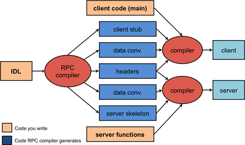

# RPC 应用篇

- [1. RPC 编译概述](#1-rpc-编译概述)
- [2. RPC API](#2-rpc-api)
- [3. RPC 框架发展概述](#3-rpc-框架发展概述)
  - [3.1. 第一代RPC：简单过程调用](#31-第一代rpc简单过程调用)
  - [3.2. 第二代RPC：对象支持](#32-第二代rpc对象支持)
  - [3.3. 第三代RPC，与Web服务](#33-第三代rpc与web服务)
- [4. RPC 与其他协议架构](#4-rpc-与其他协议架构)
  - [4.1. RPC 与 REST 的区别](#41-rpc-与-rest-的区别)
  - [4.2. Google Protocol Buffers：仅编码处理（Marshaling）](#42-google-protocol-buffers仅编码处理marshaling)
- [5. RPC 框架的选择](#5-rpc-框架的选择)
- [6. 参考文献](#6-参考文献)

主要介绍RPC的编译、API、框架的发展、不同协议的比较以及如何选择RPC框架。

## 1. RPC 编译概述

当今许多流行的语言（C，C ++，Python，Scheme等）都没有为远程过程设计内置语法，因此无法生成必要的stub函数。为了支持这些语言使用远程过程调用，通常采用的解决方案是提供一个单独的编译器，该编译器生成客户端和服务器stub函数。该编译器从程序员指定的远程过程调用接口定义中获取输入。这种的定义是用**接口定义语言IDL**编写的。

接口定义通常看起来类似于**函数原型声明**：它枚举函数集以及输入和返回参数。运行RPC编译器后，可以编译客户端和服务器程序，并与相应的stub函数链接（上图）。与本地调用不同的是，需要在客户端初始化RPC（例如，定位服务器、建立需要的连接）并处理远程过程调用的异常情况。

- IDL：接口定义语言
- client code：调用client stub定义的远程调用接口
- server functions：实现调用逻辑

## 2. RPC API

使用一个RPC框架时，需要先了解它能提供的API。任何RPC框架都需要提供一组库函数接口。主要包括：

1. 名称服务操作（Name service operations）
注册并查找绑定信息（端口，主机IP）。允许应用程序使用动态（操作系统分配的）端口。
2. 绑定操作（Binding operations）
使用适当的协议建立客户端/服务器通信。
3. 端点操作（Endpoint operations）
将端点信息（协议，端口号，主机名）注册到名称服务器，并侦听过程调用请求。这些功能通常是由自动生成的主程序（服务器stub（骨架））调用。
4. 安全操作（Security operations）
该系统应为客户端和服务器提供机制，使其能够相互**认证**并在两者之间提供**安全的通信通道**。
5. 可能的国际化业务（Internationalization operations）
这些很少是RPC程序包的一部分，但可能包括通过字符串表转换时间格式，货币格式和特定​​于语言的字符串的功能。
6. 编码/数据转换操作（Marshaling/data conversion operations）
将数据序列化为平面字节数组以传输到网络上的功能，以及重构数据的功能。
7. stub的内存管理和垃圾回收
stub可能需要分配内存来存储参数，特别是模拟**按引用传递**的语义。RPC软件包需要分配和清理任何此类内存分配。他们可能还需要分配内存以创建网络缓冲区。对于支持对象的RPC程序包，RPC系统需要一种方法来跟踪远程客户端是否仍然具有对对象的引用，以确定是否可以删除对象。
8. 程序ID操作
允许应用程序访问RPC接口集的标识符（或句柄），以便可以通信和使用服务器提供的接口集。即确认哪些远程服务可以调用。
9. 对象和函数ID操作
允许将对远程功能或远程对象的引用传递给其他进程。并非所有的RPC系统都支持此功能。

## 3. RPC 框架发展概述

这里只是简单说明RPC框架的变迁过程，更加详细的说明可以参考文章：[Remote Procedure Calls](https://www.cs.rutgers.edu/~pxk/417/notes/03-rpc.html#fnref:2)。了解RPC框架的变迁过程，我们能更加清楚RPC的应用场景，帮助我们如何在应用中选择合适的协议框架。

### 3.1. 第一代RPC：简单过程调用

ONC RPC是RPC库和RPC编译器的首批商业产品之一，是由Sun Microsystems开发的，也称为Sun RPC。它是一个非常轻便（且功能轻巧）的RPC系统，可用于大多数POSIX和类似POSIX的操作系统，包括Linux，SunOS，OS X和各种BSD，是C语言可以使用的一个RPC框架。

Sun RPC比较简单，存在一些不足。比如客户端必须知道服务器所在的地址，这对于分布式计算环境来说是不友好的。

### 3.2. 第二代RPC：对象支持

随着1980年代后期开始面向对象的语言开始流行，RPC也需要透明的方式支持面向对象的编程技术。主要的框架有Microsoft DCOM（COM +）、CORBA、Java RMI

### 3.3. 第三代RPC，与Web服务

在引入Web浏览器之后，随着Internet的使用猛增，浏览器成为访问信息的主要模型。大部分设计优先考虑以浏览器网页的方式来给用户访问，而不是通过编程方式来访问数据。

传统的RPC解决方案当然可以在Internet上运行，但是它们的问题是它们通常依赖于动态端口分配（需要与名称服务器联系，以查找提供一组特定接口的服务器的端口）。这对于防火墙是不友好的，防火墙会限制可用端口，甚至可能检查协议以确保正确性，例如HTTP流量确实为有效HTTP格式。

为了适应Web应用的发展，出现了一些新的RPC框架。

**XML-RPC**于1998年设计的RPC消息传递协议，用于将过程请求和响应编组为人类可读的XML。XML格式使用显式类型编码参数并通过**HTTP协议**进行传输，从而缓解了传统的企业防火墙问题，即必须为RPC服务器应用程序打开其他端口。基于该协议衍生出很多其他的RPC框架。

所以前面提到基于RPC的效率会更好，为什么还会出现基于HTTP协议的RPC呢？主要还是从可用性方面考虑的。

另外还有JSON-RPC等等。

## 4. RPC 与其他协议架构

### 4.1. RPC 与 REST 的区别

进入Web服务领域，出现了语义更加简洁、灵活的“协议”REST。

#### 4.1.1. 什么是REST

REST是一种架构风格，指的是一组架构约束条件和原则。满足这些约束条件和原则的应用程序或设计就是 RESTful。REST规范把所有内容都视为资源，网络上一切皆资源。

REST并没有创造新的技术，组件或服务，只是使用Web的现有特征和能力。 可以完全通过HTTP协议实现，使用 HTTP 协议处理数据通信。REST架构对资源的操作包括获取、创建、修改和删除资源的操作正好对应HTTP协议提供的GET、POST、PUT和DELETE方法。

HTTP动词与REST风格CRUD对应关系：

| Method | CRUD                   |
| ------ | ---------------------- |
| POST   | Create(update, delete) |
| GET    | Read                   |
| PUT    | Update(create)         |
| DELETE | Delete                 |

REST通常以业务为导向，格式非常简单，可以使用浏览器进行扩展和传输，一般通过JSON数据完成客户端和服务端之间的消息通信，直接支持请求/响应方式的通信。不需要中间的代理，简化了系统的架构，不同系统之间只需要对JSON进行解析和序列化即可完成数据的传递。

#### 4.1.2. REST 与 RPC 比较

都是网络交互的协议规范。通常用于多个微服务之间的通信协议。

| 比较项   | REST | RPC         |
| -------- | ---- | ----------- |
| 通信协议 | HTTP | 一般使用TCP |
| 性能     | 低   | 高          |
| 灵活度   | 高   | 低          |

REST和RPC都常用于微服务架构中:

1. HTTP相对更规范，更标准，更通用，无论哪种语言都支持http协议。如果你是对外开放API，例如开放平台，外部的编程语言多种多样，你无法拒绝对每种语言的支持，现在开源中间件，基本最先支持的几个协议都包含RESTful。
2. RPC 框架作为架构微服务化的基础组件，它能大大降低架构微服务化的成本，提高调用方与服务提供方的研发效率，屏蔽跨进程调用函数（服务）的各类复杂细节。让调用方感觉就像调用本地函数一样调用远端函数、让服务提供方感觉就像实现一个本地函数一样来实现服务。

本质来说，REST和RPC都一样，都是对外提供特定服务的。REST调用及测试都很方便，RPC就显得有点繁琐，但是RPC的效率是毋庸置疑的，所以建议在多系统之间的**内部调用采用RPC**。对外提供的**应用服务**，**REST更加合适**。

但是REST也存在一些弊端，比如只支持请求/响应这种单一的通信方式，对象和字符串之间的序列化操作也会影响消息传递速度，客户端需要通过服务发现的方式，知道服务实例的位置，在单个请求获取多个资源时存在着挑战，而且有时候很难将所有的动作都映射到HTTP动词。

### 4.2. Google Protocol Buffers：仅编码处理（Marshaling）

有时候，既不需要RPC也不需要Web服务，但是程序员只是想简化网络上数据的编组（marshaling）和解组（unmarshaling）任务。 Google Protocol Buffers提供了一种用于序列化结构化数据的有效机制，从而可以轻松地将数据编码到网络上并解码接收到的数据。协议缓冲区是一种**紧凑的二进制格式**，**它比XML更简单，更小且速度更快**。它们**与语言无关**，仅用于定义数据类型。每个消息是一组结构化的数据名称，类型和值。消息结构以高级格式定义，类似于许多接口定义语言（IDL）。然后编译该文件以生成您选择的语言的转换例程。Protocol Buffers在Google内部广泛使用。当前定义了超过48,000种不同的消息类型。**它们既用于类似RPC的消息传递，也用于持久性存储**。在持久性存储中，您需要将数据转换为标准的串行形式以将其写入文件中。

## 5. RPC 框架的选择

Nelson 论文中给出的这个实现结构也成为了后来大家参考的标准范本。为了解决异构平台的 RPC，大部分框架使用了 IDL（Interface Definition Language）来定义远程接口，并将其映射到特定的平台语言中（从而提供跨语言平台的能力）。具体来说是，通过 IDL 定义接口，并提供工具来映射生成不同语言平台的 user-stub 和 server-stub，并通过框架库来提供 RPCRuntime 的支持。

目前，不同的 RPC 框架往往具有不同的 IDL 格式，导致程序员的学习成本进一步上升。现在市面上提供的 RPC 框架可谓是五花八门、百家争鸣。选择RPC框架时需要注意哪些因素呢？网上的一篇博客提到了以下几点：

1. 性能指标
2. 是否需要跨语言平台
3. 内网开放还是公网开放
4. 开源 RPC 框架本身的质量、社区活跃度

显然，我们选择性能高、社区活跃度高的RPC框架；另外，根据项目的需要，确定是否需要跨语言平台、项目实施是否公网开放，一般来说，公网开放对RPC的安全性要求更高。

## 6. 参考文献

1. Remote Procedure Calls: <https://www.cs.rutgers.edu/~pxk/417/notes/03-rpc.html#fnref:2>
2. 面试问题：REST与RPC区别？: <https://baijiahao.baidu.com/s?id=1617168792520937104&wfr=spider&for=pc>
3. 什么是RPC？: <https://www.jianshu.com/p/7d6853140e13>