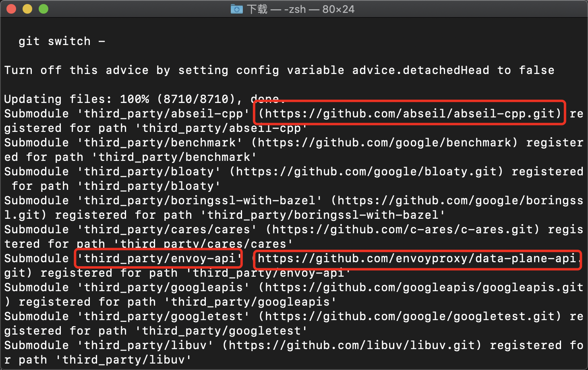
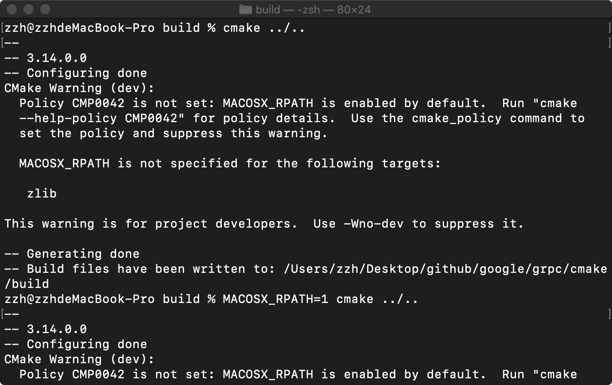

# RPC Build

安装C++语言版本。

1. **本文主要参考**：<https://grpc.io/docs/languages/cpp/quickstart/>
2. 从源码安装的详细文档：<https://github.com/grpc/grpc/blob/master/BUILDING.md>

## 1. macOS

### 1.1. 依赖安装和环境配置

首先需要按照官网教程[安装protobuf](https://github.com/protocolbuffers/protobuf/blob/master/src/README.md)。

然后，按照上述参考文档1的的说明进行环境配置（不过安装了protobuf后，环境依赖基本上装好了）。

### 1.2. 克隆代码

文档给出的克隆方式是将原仓库和子模块一起克隆下来：

```shell
git clone --recurse-submodules -b v1.34.1 https://github.com/grpc/grpc
```

由于代码非常多，两百多，接近三百兆，如果网络不好，clone会非常慢。

**使用国内镜像，手动克隆子模块。**

1. 首先克隆grpc代码，但不含子模块。
    这是常规的clone命令：

    ```shell
    git clone -b v1.35.0 https://github.com/grpc/grpc  # 目前最新版是v1.35.0
    ```

    改用国内镜像，参考：<https://blog.csdn.net/u014630636/article/details/106181159/>

    ```shell
    git clone -b v1.35.0 https://github.com.cnpmjs.org/grpc/grpc
    ```

    克隆好后，再下载子模块，此时还是非常慢，因为子模块的clone仍是从github.com上下载。

    这里使用比较笨但有效的方法：手动逐个子模块进行clone。

    运行下面命令(另外的目录下)：

    ```shell
    git clone --recurse-submodules -b v1.35.0 https://github.com.cnpmjs.org/grpc/grpc
    ```

    上面的命令下载完顶层仓库代码后，会打印所有子模块的来源地址。

    

    然后到之前克隆好的grpc中third_party目录下，逐个子模块进行手动clone，将每个子模块的来源改成国内镜像即可。注意的是，clone会使用默认目录名，要注意按照项目的要求，重命名子模块，并且放置到正确的路径下。

### 1.3. 编译安装

按照教程，运行cmake命令时，会报错。



参考：<https://stackoverflow.com/questions/31561309/cmake-warnings-under-os-x-macosx-rpath-is-not-specified-for-the-following-targe>

在CMakeLists.txt中添加 `set(CMAKE_MACOSX_RPATH 1)`，然后就可以正常编译安装。

### 1.4. 运行样例程序

最后，按照教程，自己跑一下Hello World程序，体验gRPC的效果。
